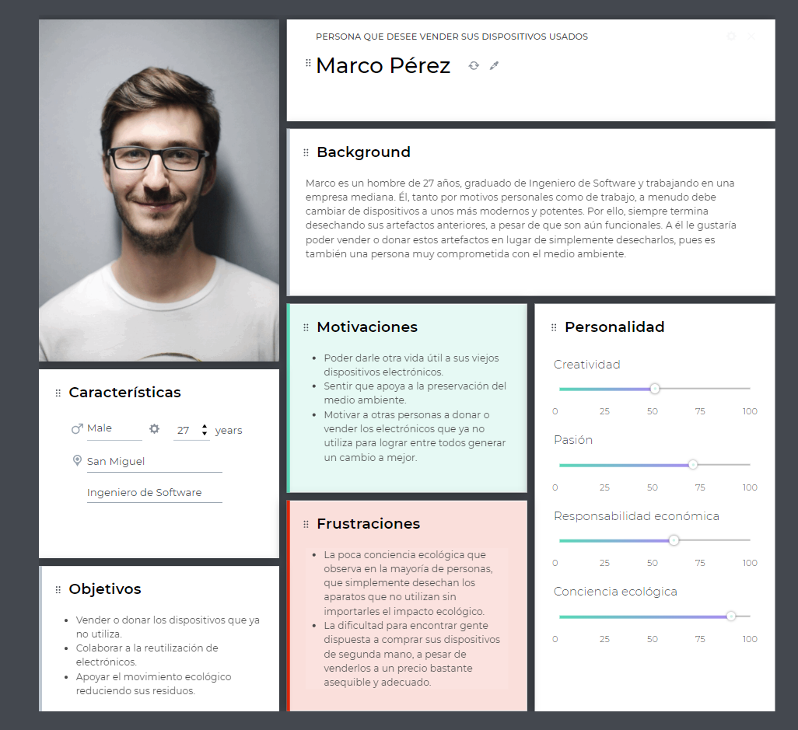

**Universidad Peruana de Ciencias Aplicadas**

**Ingeniería de Software**

**Ciclo 2024-01**

# COURSE PROJECT
### Profesor: Hugo Allan Mori Paiva
### Curso: Desarrollo de Aplicaciones Open Source
# FINAL REPORT
## Startup: 
## Propuesta: 
**Team Members**
- Chamorro Acero, Salvador Edward
- Jorge Arévalo, Ramón Alejandro 
- Morales Montalvo, Omar Andrew
- Palomino Fano, Cristhofer Sebastian  

**Marzo 2024**

------

## Registro de Versiones del Informe

<table>
  <thead>
    <tr>
      <th>Versión</th>
      <th>Fecha</th>
      <th>Autor</th>
      <th>Descripción de modificación</th>
    </tr>
  </thead>
  <tbody>
    <tr>
      <td>1era</td>
      <td>20/03/2024</td>
      <td>
        - Chamorro Acero, Salvador Edward     
        - Palomino Fano, Cristhofer Sebastian  
        - Morales Montalvo, Omar Andrew  
      </td>
      <td>
        Capítulo I: Introducción  
        1.1. Startup Profile  
        1.1.1. Descripción de la Startup  
        1.1.2. Perfiles de integrantes del equipo  
        1.2. Solution Profile  
        1.2.1 Antecedentes y problemática  
        1.2.2 Lean UX Process.  
        1.2.2.1. Lean UX Problem Statements.  
        1.2.2.2. Lean UX Assumptions.  
        1.2.2.3. Lean UX Hypothesis Statements.  
        1.2.2.4. Lean UX Canvas.  
        1.3. Segmentos objetivo.  
         
        Capítulo II: Requirements Elicitation & Analysis  
        2.1. Competidores.  
        2.1.1. Análisis competitivo.  
        2.1.2. Estrategias y tácticas frente a competidores.  
        2.2. Entrevistas.  
        2.2.1. Diseño de entrevistas.  
        2.2.2. Registro de entrevistas.  
        2.2.3. Análisis de entrevistas.  
        2.3. Needfinding.  
        2.3.1. User Personas.  
        2.3.2. User Task Matrix.  
        2.3.3. User Journey Mapping.  
        2.3.4. Empathy Mapping.  
        2.3.5. As-is Scenario Mapping.  
        2.4. Ubiquitous Language.  
         
        Capítulo III: Requirements Specification  
        3.1. To-Be Scenario Mapping.  
        3.2. User Stories.  
        3.3. Impact Mapping.  
        3.4. Product Backlog.  
         
        Capítulo IV: Product Design  
        4.1. Style Guidelines.  
        4.1.1. General Style Guidelines.  
        4.1.2. Web Style Guidelines.  
        4.2. Information Architecture.  
        4.2.1. Organization Systems.  
        4.2.2. Labeling Systems.  
        4.2.3. SEO Tags and Meta Tags  
        4.2.4. Searching Systems.  
        4.2.5. Navigation Systems.  
        4.3. Landing Page UI Design.  
        4.3.1. Landing Page Wireframe.  
        4.3.2. Landing Page Mock-up.  
        4.4. Web Applications UX/UI Design.  
        4.4.1. Web Applications Wireframes.  
        4.4.2. Web Applications Wireflow Diagrams.  
        4.4.2. Web Applications Mock-ups.  
        4.4.3. Web Applications User Flow Diagrams.  
        4.5. Web Applications Prototyping.  
        4.6. Domain-Driven Software Architecture.  
        4.6.1. Software Architecture Context Diagram.  
        4.6.2. Software Architecture Container Diagrams.  
        4.6.3. Software Architecture Components Diagrams.  
        4.7. Software Object-Oriented Design.  
        4.7.1. Class Diagrams.  
        4.7.2. Class Dictionary.  
        4.8. Database Design.  
        4.8.1. Database Diagram.  
         
      </td>
    </tr>
  </tbody>
</table>

## Project Report Collaboration Insights

## Contenido
**Tabla de contenidos**

|Tabla de contenidos|
|------------------------|
|[Capítulo I: Introducción](#capítulo-i-introducción)|
|[1.1. Startup Profile](#11-startup-profile)|
|[1.1.1. Descripción de la Startup](#111-descripción-de-la-startup)|
|[1.1.2. Perfiles de integrantes del equipo](#112-perfiles-de-integrantes-del-equipo)|
|[1.2. Solution Profile](#12-solution-profile)|
|[1.2.1 Antecedentes y problemática](#121-antecedentes-y-problemática)|
|[1.2.2. Lean UX Process](#122-lean-ux-process)|
|[1.2.2.1. Lean UX Problem Statements](#1221-lean-ux-problem-statements)|
|[1.2.2.2. Lean UX Assumptions](#1222-lean-ux-assumptions)|
|[1.2.2.3. Lean UX Hypothesis Statements](#1223-lean-ux-hypothesis-statements)|
|[1.2.2.4. Lean UX Canvas](#1224-lean-ux-canvas)|
|[1.3. Segmentos objetivo](#13-segmentos-objetivo)|
|[Capítulo II: Requirements Elicitation & Analysis](#capítulo-ii-requirements-elicitation--analysis)|
|[2.1. Competidores](#21-competidores)|
|[2.1.1. Análisis competitivo](#211-análisis-competitivo)|
|[2.1.2. Estrategias y tácticas frente a competidores](#212-estrategias-y-tácticas-frente-a-competidores)|
|[2.2. Entrevistas](#22-entrevistas)|
|[2.2.1. Diseño de entrevistas](#221-diseño-de-entrevistas)|
|[2.2.2. Registro de entrevistas](#222-registro-de-entrevistas)|
|[2.2.3. Análisis de entrevistas](#223-análisis-de-entrevistas)|
|[2.3. Needfinding](#23-needfinding)|
|[2.3.1. User Personas](#231-user-personas)|
|[2.3.2. User Task Matrix](#232-user-task-matrix)|
|[2.3.3. User Journey Mapping](#233-user-journey-mapping)|
|[2.3.4. Empathy Mapping](#234-empathy-mapping)|
|[2.3.5. As-is Scenario Mapping](#235-as-is-scenario-mapping)|
|[2.4. Ubiquitous Language](#24-ubiquitous-language)|
|[Capítulo III: Requirements Specification](#capítulo-iii-requirements-specification)|
|[3.1. To-Be Scenario Mapping](#31-to-be-scenario-mapping)|
|[3.2. User Stories](#32-user-stories)|
|[3.3. Impact Mapping](#33-impact-mapping)|
|[3.4. Product Backlog](#34-product-backlog)|
|[Capítulo IV: Product Design](#capítulo-iv-product-design)|
|[4.1. Style Guidelines](#41-style-guidelines)|
|[4.1.1. General Style Guidelines](#411-general-style-guidelines)|
|[4.1.2. Web Style Guidelines](#412-web-style-guidelines)|
|[4.2. Information Architecture](#42-information-architecture)|
|[4.2.1. Organization Systems](#421-organization-systems)|
|[4.2.2. Labeling Systems](#422-labeling-systems)|
|[4.2.3. SEO Tags and Meta Tags](#423-seo-tags-and-meta-tags)|
|[4.2.4. Searching Systems](#424-searching-systems)|
|[4.2.5. Navigation Systems](#425-navigation-systems)|
|[4.3. Landing Page UI Design](#43-landing-page-ui-design)|
|[4.3.1. Landing Page Wireframe](#431-landing-page-wireframe)|
|[4.3.2. Landing Page Mock-up](#432-landing-page-mock-up)|
|[4.4. Web Applications UX/UI Design](#44-web-applications-uxui-design)|
|[4.4.1. Web Applications Wireframes](#441-web-applications-wireframes)|
|[4.4.2. Web Applications Wireflow Diagrams](#442-web-applications-wireflow-diagrams)|
|[4.4.3. Web Applications Mock-ups](#443-web-applications-mock-ups)|
|[4.4.4. Web Applications User Flow Diagrams](#444-web-applications-user-flow-diagrams)|
|[4.5. Web Applications Prototyping](#45-web-applications-prototyping)|
|[4.6. Domain-Driven Software Architecture](#46-domain-driven-software-architecture)|
|[4.6.1. Software Architecture Context Diagram](#461-software-architecture-context-diagram)|
|[4.6.2. Software Architecture Container Diagrams](#462-software-architecture-container-diagrams)|
|[4.6.3. Software Architecture Components Diagrams](#463-software-architecture-components-diagrams)|
|[4.7. Software Object-Oriented Design](#47-software-object-oriented-design)|
|[4.7.1. Class Diagrams](#471-class-diagrams)|
|[4.7.2. Class Dictionary](#472-class-dictionary)|
|[4.8. Database Design](#48-database-design)|
|[4.8.1. Database Diagram](#481-database-diagram)|
|[Bibliografía](#bibliografía)|

# Student Outcome

**ABET – EAC – Student Outcome 5**

Criterio: *La capacidad de funcionar efectivamente en un equipo cuyos miembros juntos proporcionan liderazgo, crean un entorno de colaboración e inclusivo, establecen objetivos, planifican tareas y cumplen objetivos.*

En el siguiente cuadro se describen las acciones realizadas y enunciados de conclusiones por parte del grupo, que permiten sustentar el haber alcanzado el logro del ABET – EAC – Student Outcome 5.

<table>
  <thead>
    <tr>
      <th>Criterio específico</th>
      <th>Acciones realizadas</th>
      <th>Conclusiones</th>
    </tr>
  </thead>
  <tbody>
    <tr>
      <td>Participa en equipos multidisciplinarios con eficacia, eficiencia y objetividad, en el marco de un proyecto en soluciones de ingeniería de software.</td>
      <td></td>
      <td>
      </td>
    </tr>
    <tr>
      <td>Conoce al menos un sector empresarial o dominio de aplicación de soluciones de software.</td>
      <td></td>
      <td>
      </td>
    </tr>
  </tbody>
</table>

# Capítulo I: Introducción
## 1.1. Startup Profile
### 1.1.1 Descripción de la Startup
RecyTech es una plataforma digital que aborda el desafío de la gestión ineficiente de desechos electrónicos. En un mundo donde la tecnología avanza rápidamente, la obsolescencia de dispositivos electrónicos es común, lo que genera una acumulación significativa de residuos. Nuestra plataforma proporciona una solución integral al permitir a los usuarios donar, vender y comprar componentes electrónicos reacondicionados, promoviendo así la reutilización y el reciclaje.

Nos comprometemos a ofrecer una alternativa sostenible y accesible para personas de todos los niveles socioeconómicos. Desde personas de bajos recursos económicos hasta consumidores conscientes del medio ambiente, nuestra plataforma ofrece una oportunidad para contribuir activamente al cuidado del medio ambiente mientras se accede a tecnología a precios más asequibles. Trabajamos en estrecha colaboración con organizaciones ambientales y educativas para promover la conciencia sobre la importancia del reciclaje y la reutilización de dispositivos electrónicos.

En RecyTech, creemos en el poder de la tecnología para generar un impacto positivo en el mundo. Estamos decididos a liderar el cambio hacia una gestión más responsable de los desechos electrónicos y a construir un futuro más sostenible y equitativo para todos. Juntos, podemos trabajar hacia un futuro donde la tecnología se utilice de manera consciente y sostenible, beneficiando a las generaciones presentes y futuras.

|Misión|Visión|
|------|------|
|Nuestra misión en RecyTech es transformar la forma en que se gestionan los desechos electrónicos al ofrecer una solución inclusiva y sostenible que mejore el acceso a la tecnología y proteja el medio ambiente. Nos comprometemos a proporcionar una plataforma segura y fácil de usar que empodere a las comunidades para contribuir activamente al reciclaje y la reutilización de dispositivos electrónicos, promoviendo un futuro más verde y equitativo para todos.|En RecyTech, visualizamos un mundo donde la tecnología se utiliza de manera responsable y sostenible, donde cada dispositivo electrónico tiene una segunda vida y donde el acceso a la tecnología no está limitado por barreras económicas. Nos esforzamos por ser líderes en la industria de gestión de desechos electrónicos, creando un impacto positivo en las comunidades al fomentar la economía circular y reducir el impacto ambiental de la tecnología obsoleta.|

### 1.1.2. Perfiles de integrantes del equipo

|<!-- -->|<!-- -->|
|--------|--------|
|Nombre|Morales Montalvo, Omar Andrew (U202212383)|
|Soy Omar Andrew Morales Montalvo de la carrera de Ingeniería de Software en la Universidad Peruana de Ciencias Aplicadas, estoy cursando en quinto ciclo y actualmente tengo 18 años, soy colaborativo, responsable y proactivo, tratando de ayudar a los demás en lo que mi alcance me lo permita. Por ello, actuare de igual manera con mi grupo apoyando en lo más que pueda en los trabajos futuros. ||

**Palomino Fano, Cristhofer Sebastian:**

  

Actualmente estudio la carrera de Ingeniería de Software en la universidad UPC. Me comprometo a apoyar y dar todo de mis capacidades a mi equipo y a cumplir con mis deberes en la construcción del proyecto. Tengo conocimientos aprendidos antecesoras a este curso como C++, C#, Python, Java junto a desarrollo de Apis con base de datos con SQL y aprendizaje autónomo sobre ciberseguridad

## 1.2. Solution Profile
### 1.2.1	Antecedentes y problemática

En los últimos años, el Perú ha experimentado un notable aumento en la adopción de tecnología y dispositivos electrónicos, lo que ha resultado en un incremento en la cantidad de desechos electrónicos generados. Sin embargo, hasta hace poco, el país carecía de una regulación efectiva para gestionar adecuadamente estos residuos, lo que ha llevado a una disposición inapropiada y ha contribuido a la contaminación ambiental. Una parte significativa de la gestión de estos desechos se ha realizado en el sector informal, donde trabajadores recolectan, desmontan y reciclan estos dispositivos sin tomar las precauciones ambientales y de seguridad necesarias, agravando los problemas ambientales y de salud pública. Es crucial señalar que en lugar de desechar completamente algunos dispositivos, es posible reacondicionar ciertas partes para su uso en nuevos productos, fomentando así la reutilización y reduciendo la cantidad de desechos electrónicos generados.

El mercado de productos electrónicos en Perú experimentó un notable crecimiento durante un período de 15 años, desde 1995 hasta 2010. Se proyectó un aumento significativo en la generación de residuos electrónicos, con una estimación de 37,828 toneladas para 2010 y un aumento previsto del 32% para 2011. En cuanto a los teléfonos celulares, se observó un aumento constante en el número de líneas activas desde 2002, con una estimación de 2,900 toneladas de celulares listos para su disposición final en 2010, y se esperaba una reducción del 30% para 2011 debido a avances tecnológicos.

Los equipos electrónicos obsoletos pueden ser almacenados temporalmente antes de decidir qué hacer con ellos. Las opciones incluyen descartarlos, venderlos, donarlos o reutilizarlos. Si se descartan, pueden desmantelarse para recuperar componentes como repuestos o reciclarse adecuadamente.

**Problemática:**

|<!-- -->|<!-- -->|
|--------|--------|
|What (Qué): ¿Cuál es el problema?|El Perú ha experimentado un notable aumento en la adopción de tecnología y dispositivos electrónicos en los últimos años, lo que ha generado un incremento en la cantidad de desechos electrónicos.|
|When (Cuándo): ¿Cuándo sucede el problema?|Este aumento en la generación de desechos electrónicos se ha registrado durante un período de al menos 15 años, desde 1995 hasta 2010, con proyecciones para los años siguientes.|
|Where (Dónde): ¿Dónde se presenta el problema de negocio?|Principalmente en el territorio peruano, donde se ha observado un crecimiento en la generación de desechos electrónicos.|
|Who (Quienes): ¿Quiénes están involucrados?|La población peruana, así como también empresas y organizaciones que utilizan dispositivos electrónicos.|
|Why (Por qué): ¿Por qué se origina el problema?| La falta de una regulación efectiva en la gestión de estos residuos ha llevado a una disposición inapropiada, contribuyendo a la contaminación ambiental y exacerbando problemas de salud pública. Además, parte de la gestión de estos desechos se realiza en el sector informal, sin las precauciones necesarias.|
|How (Cómo): ¿Cómo afecta este problema a las personas involucradas?|Los equipos electrónicos obsoletos pueden ser almacenados temporalmente antes de ser descartados, vendidos, donados o reutilizados. En caso de descarte, pueden desmantelarse para recuperar componentes útiles o reciclarse adecuadamente.|
|How much (Cuánto): ¿Cuánto impacto genera el problema en la sociedad?|Aunque no se especifica un número exacto de desechos electrónicos generados, se menciona un notable aumento en la cantidad, especialmente proyectando cifras para el año 2010.|

### 1.2.2 Lean UX Process
#### 1.2.2.1 Lean UX Problem Statement
El Perú enfrenta un desafío significativo en la gestión de desechos electrónicos debido al aumento en la adopción de tecnología y dispositivos electrónicos en los últimos años. La falta de regulación sólida ha resultado en una disposición inadecuada de estos desechos, contribuyendo a la contaminación ambiental y problemas de salud pública. Es crucial desarrollar políticas y prácticas efectivas de gestión de desechos electrónicos que promuevan la reutilización, el reciclaje y la disposición adecuada para proteger el medio ambiente y la salud de la población peruana.

Ante esta situación, surge nuestra pregunta de negocio: ¿Como podemos ayudar a las personas para que accedan a tecnologia contribuyendo asi al medio ambiente?

#### 1.2.2.2 Lean UX Assumptions

- Business Assumptions:

1. Demanda del mercado: Suponemos que existe una demanda suficiente de componentes electrónicos usados y nuevos para justificar la creación de una plataforma de compraventa especializada.

2. Atracción de vendedores: Suponemos que los vendedores estarán interesados en utilizar nuestra plataforma, especialmente si les ofrecemos un servicio de garantía de recompra y la posibilidad de llegar a una audiencia más amplia.

3. Sostenibilidad económica: Suponemos que el modelo de negocio basado en suscripciones y comisiones por ventas nos permitirá generar suficientes ingresos para mantener la plataforma y ofrecer los servicios adicionales prometidos.

- Business Outcomes:
  
1. Generación de ingresos: Esperamos generar ingresos consistentes a través de las suscripciones de los vendedores y las comisiones por las ventas realizadas en la plataforma.

2. Crecimiento de la base de usuarios: Esperamos atraer y retener a un número creciente de usuarios, tanto vendedores como compradores, a medida que nuestra plataforma se convierta en un destino popular para la compraventa de componentes electrónicos.

3. Construcción de marca: Esperamos establecer nuestra marca como una autoridad en el mercado de componentes electrónicos usados y nuevos, asociada con la confiabilidad y la equidad en las transacciones.

- User Benefits:

1. Acceso a tecnología asequible: Los usuarios de bajos recursos podrán acceder a componentes electrónicos a precios más bajos, lo que les permitirá participar en proyectos y actividades que de otra manera no podrían permitirse.

2. Facilidad de transacción: Tanto los compradores como los vendedores se beneficiarán de una plataforma fácil de usar que simplifica el proceso de compraventa de componentes electrónicos y ofrece garantías adicionales para las transacciones.
   
3. Oportunidad de ingresos: Los vendedores tendrán la oportunidad de ganar dinero vendiendo componentes electrónicos no deseados o excedentes, con la garantía de que recibirán un retorno, ya sea a través de la venta del producto o mediante el reembolso completo si no se vende.
  
#### 1.2.2.3. Lean UX Hypothesis Statements

- **Creemos que** al proporcionar acceso a componentes electrónicos a precios más bajos, especialmente para usuarios de bajos recursos. **Sabremos que** hemos tenido exito, **cuando** observemos un aumento en la participación de este grupo demográfico en nuestra plataforma y recibamos comentarios positivos sobre la asequibilidad de nuestros productos.

- **Creemos que** al implementar un sistema de suscripción para los vendedores que incluya una garantía de recompra y la opción de establecer deadlines para la venta de productos. **Sabremos que** hemos tenido exito **cuando** veamos un incremento significativo en el número de suscripciones activas y una mayor frecuencia de listado de productos por parte de los vendedores.

- **Creemos que** al mejorar la experiencia del usuario mediante la simplificación del proceso de compraventa de componentes electrónicos y la inclusión de garantías adicionales para las transacciones. **Sabremos que** hemos tenido exito **cuando**  observemos una disminución en las tasas de abandono del carrito de compras y una mayor frecuencia de retorno de los usuarios a nuestra plataforma.

#### 1.2.2.4. Lean UX Canvas

### Business Problem :
- La gestión ineficiente de los desechos electrónicos debido a la falta de regulación y disposición inapropiada está generando contaminación ambiental y problemas de salud pública y creación de oportunidades para personas de bajos recursos.
### Users & Customers :
- Personas que deseen adquirir componentes a un precio accesible.
- Personas donantes que deseen deshacerse de componentes en desuso.
### Hypotheses :
- Creemos que al proporcionar una plataforma donde los usuarios puedan donar o vender componentes electrónicos, y otros puedan comprarlos a precios accesibles, podremos satisfacer las necesidades de personas de recursos limitados y diferenciarnos en el mercado.
### Solution ideas :
- Desarrollar una aplicación móvil y una plataforma web donde los usuarios puedan donar o vender componentes electrónicos.
- Implementar un sistema de verificación de calidad para garantizar que los componentes reacondicionados sean funcionales y seguros para su uso.
- Ofrecer precios accesibles para los componentes electrónicos, especialmente dirigidos a personas de recursos limitados.
### What's the most important thing we need to learn  first? :
- Necesitamos entender las necesidades y preferencias de las personas de recursos limitados con respecto a la compra de componentes electrónicos reacondicionados, así como también comprender los desafíos y preocupaciones de los vendedores y donantes potenciales.
### Business Outcomes :
- Mejora de la reputación y responsabilidad social corporativa.
- Aumento de la accesibilidad económica a componentes electrónicos para personas de recursos limitados.
- Reducción de la cantidad de desechos electrónicos mediante la reutilización de componentes funcionales.
### User Benefits :
- Acceso a componentes electrónicos funcionales a precios más bajos.
- Oportunidad de contribuir al cuidado del medio ambiente al reciclar y reutilizar componentes electrónicos.
- Mayor acceso a la tecnología para personas de recursos limitados.
### What's the least amount of work we need to do learn the next most important thing? :
- Realizar encuestas y entrevistas con personas de recursos limitados para comprender sus necesidades y preferencias con respecto a la compra de componentes electrónicos reacondicionados, así como también entrevistar a posibles vendedores y donantes para comprender sus motivaciones y preocupaciones.

#### 1.3. Segmentos Objetivos
- Nuestros segmentos objetivos incluyen a personas de bajos recursos económicos, entre 19 y 60 años de edad, que buscan acceso a componentes electrónicos reacondicionados a precios más asequibles, consumidores conscientes del medio ambiente interesados en contribuir al reciclaje y reutilización de dispositivos electrónicos, así como vendedores o donantes que desean deshacerse de sus dispositivos de manera responsable y ética. Estamos comprometidos en ofrecer una plataforma que satisfaga las necesidades de estos segmentos al proporcionar una solución accesible, sostenible y socialmente responsable para la gestión de desechos electrónicos.

# Capítulo II: Requirements Elicitation & Analysis

## 2.1. Competidores
### 2.1.1. Análisis competitivo

<table>
    <thead>
    <tr>
    <th colspan= 6>Competitive Analysis Landscape</th>
    </tr>
        <tr>
    <th colspan= 6>El objetivo del análisis fue investigar y evaluar a los posibles competidores para identificar sus estrategias de mercado y aprender qué estrategias nos podrían funcionar y cómo podríamos destacar en dicho mercado.</th>
    </tr>
        <tr>
    <th colspan= 6>¿Cuáles podrían ser las estrategias efectivas para diferenciar y destacar nuestra aplicación 'RecyTech' en el mercado de manera que promueva el reciclaje y la reutilización de los dispositivos y componentes electrónicos? </th>
    </tr>
        <tr>
            <th colspan= 2></th>
            <th>ElectronicsMarketplace</th>
            <th>Slang・Buy & Sell Electronics</th>
            <th>Swappa</th>
            <th>RAECO</th>
        </tr>
    </thead>
    <tbody>
        <tr>
            <td rowspan=2 align="center">Perfil</td>
            <td align="center">Overview</td>
            <td align="center">Electronics MarketPlace es una aplicación móvil orientada a la compra y venta de artículos y dispositivos electrónicos de segunda mano. Los usuarios pueden tanto poner en venta sus aparatos electrónicos como buscar dispositivos que deseen y negociar con usuarios que los tengan a la venta.</td>
            <td  align="center">Slang・Buy & Sell Electronics es una aplicación móvil para iOs que permite a los usuarios vender y comprar artículos electrónicos de segunda mano. Tiene además la posibilidad de buscar por marcas, tipo de dispositivo, años de uso, etc.</td>
            <td  align="center">Swappa es una plataforma web en la cual los usuarios pueden tanto comprar dispositivos nuevos como de segunda mano. Además, pueden vender sus dispositivos directamente a la empresa dueña de la aplicación, la cual se encargará de revenderlos.</td>
            <td align="center">RAECO es una aplicación móvil cuyo objetivo es promover el reciclaje de dispositivos y componentes electrónicos que ya no se utilicen. La aplicación los ayuda a encontrar lugares a los cuales llevar sus residuos electrónicos y, mediante videos, juegos y retos, concientiza acerca de la importancia del reciclaje electrónico. Además, ofrece recompensas mediante un sistema de puntos que se obtienen reciclando y completando actividades en la app.</td>
        </tr>
        <tr>
            <td align="center">Ventaja competitiva ¿Qué valor ofrece a los clientes?</td>
            <td align="center">Ofrece un canal directo de comunicación entre el vendedor y comprador de artículos electrónicos, una interfaz intuitiva y amigable y le ofrece beneficios a los vendedores y descuentos a los compradores según su actividad en la app.</td>
            <td align="center">Tiene una interfaz rápida y fácil de usar y ofrece funciones de búsqueda de dispositivos según la marca, tiempo de uso, tipo, etc. Además, ofrece la posibilidad de revisar la fiabilidad e historial del vendedor.</td>
            <td align="center">Ofrece la posibilidad de comprar dispositivos sin necesidad de registrarse, le da facilidades a los donadores de dispositivos electrónicos dentro de la aplicación y los usuarios tienen la posibilidad de comprar dispositivos tanto nuevos como de segunda mano, con un precio adecuado para cada uno. Además, la aplicación colabora con marcas tecnológicas y electrónicas.</td>
            <td align="center"> La aplicación contiene las localizaciones de lugares de reciclaje y los dase de datos acerca de dichos centros de reciclaje de electrónicos. Por otro lado, contiene un sistema de puntos que se ganan realizando actividades en la app tales como retos, juegos y vídeos, que luego se pueden canjear por recompensas dentro de la aplicación. Además, el usuario puede realizar un seguimiento del impacto ambiental personal y es posible recibir información sobre eventos ambientales locales.</td>
        </tr>
        <tr>
            <td rowspan= 5 align="center">Perfil de Marketing</td>
            <td align="center">Mercado Objetivo</td>
                        <td align="center">Hemos identificado tres segmentos objetivo: Las personas que deseen vender sus dispositivos y componentes electrónicos, las personas que deseen adquirir dispositivos de segunda mano a menor precio y las personas comprometidas con el cuidado del medio ambiente.</td>
            <td align="center">Hemos identificado tres segmentos objetivo: Las personas que deseen vender sus dispositivos y componentes electrónicos, las personas que deseen adquirir dispositivos de segunda mano a menor precio y las personas comprometidas con el cuidado del medio ambiente.</td>
            <td align="center">Hemos identificado dos segmentos objetivo: Las personas que deseen adquirir dispositivos y aparatos electrónicos a un menor precio y las personas que quieran donar sus artefactos y componentes electrónicos y, de preferencia, recibir una pequeña comisión a cambio.</td>
            <td align="center">Hemos identificado tres segmentos objetivo: Las personas comprometidas con el cuidado del medio ambiente, los niños y jóvenes que busquen aprender y aportar al reciclaje y las personas que deseen donar o desechar sus residuos electrónicos de una forma ecológica.</td>
        </tr>
        <tr>
                    <td align="center">Estrategias de Marketing</td>
            <td align="center">Principalmente realizan su publicidad mediante redes sociales y contienen una pequeña descripción en su página de información en Google Play Store.</td>
            <td align="center">Principalmente realizan su publicidad mediante redes sociales y contienen una pequeña descripción en su página de información en la App Store de iOs.</td>
            <td align="center">Principalmente realizan su publicidad en línea y en redes sociales, además de una Landing Page informativa en la cual detallan más profundamente las funcionalidades de la plataforma web. Además, publicitan su producto mediante su colaboración con marcas y empresas tecnológicas.</td>
            <td align="center">Principalmente realizan su publicidad mediante redes sociales y contienen una pequeña descripción en su página de información en Google Play Store. Además, realizan vídeos y publicaciones informativas acerca de la misión y visión de la empresa.</td>
        </tr>
        <tr>
                    <td align="center">Productos & servicios</td>
            <td align="center">Producto: Aplicación móvil. Servicio: Ofrecer a los usuarios un servicio de compra y venta de dispositivos y componentes electrónicos, permitiendo una comunicación directa entre comprador y vendedor a través de la aplicación.</td>
            <td align="center">Producto: Aplicación móvil. Servicio: Ofrecer a los usuarios un servicio de compra y venta de dispositivos y componentes electrónicos, facilitando servicios de búsqueda por tipo de dispositivo, marca, tiempo de uso, etc. y visualización de perfiles de vendedores.</td>
            <td align="center">Producto: Sitio web y plataforma en línea. Servicio: Ofrecer a los usuarios un servicio para vender sus dispositivos y componentes electrónicos a un precio adecuado y la posibilidad de también comprar dispositivos tanto nuevos como de segunda mano a un menor precio.</td>
            <td align="center">Producto: Aplicación móvil. Servicio: Ofrecer a  los usuarios un servicio de aprendizaje acerca de reciclaje electrónico, además de indicar centros de reciclaje electrónico y demostrar buenas prácticas para cuidar el medio ambiente, con un sistema de puntos por completas actividades en la app que se pueden cambiar por recompensas.</td>
        </tr>
                <tr>
                    <td align="center">Precios & Costos</td>
            <td align="center">Gratis.</td>
            <td align="center">Gratis.</td>
            <td align="center">Gratis.</td>
            <td align="center">Gratis.</td>
        </tr>
                <tr>
                    <td align="center">Canales de distribución (Web y/o móvil)</td>
            <td align="center">Tiendas de Aplicaciones (App Store, Google Play Store).</td>
            <td align="center">App Store de iOs.</td>
            <td align="center">Página Web Oficial.</td>
            <td align="center">Tiendas de Aplicaciones (App Store, Google Play Store).</td>
        </tr>
                <tr>
            <td rowspan= 4 align="center">Análisis SWOT</td>
            <td align="center">Fortalezas</td>
                        <td align="center">Cuenta con una interfaz intuitiva y atractiva. Ofrece un servicio novedoso que cubre un segmento objetivo específico. Brinda facilidad en la comunicación entre vendedor y comprador y facilidad en la compra.</td>
            <td align="center">Cuenta con una interfaz fácil de usar. Ofrece un servicio novedoso que cubre un segmento objetivo específico. Brinda funciones de búsqueda rápidas, satisfactorias y variadas.</td>
            <td align="center">Tiene colaboraciones con marcas y empresas tecnológicas. Ofrece una amplia variedad de productos. Cuenta con la posibilidad de comprar artículos tanto nuevos como de segunda mano, según las necesidades y presupuesto del usuario. Para los compradores, no hay necesidad de registrarse, por lo que el proceso es más rápido.</td>
            <td align="center">Ofrece una gran variedad de actividades, vídeos, juegos y recursos para aprender acerca del reciclaje electrónico. Indica centros de reciclaje electrónicos a los que pueden llevar sus productos obsoletos. Cuenta con un sistema de canje de puntos a cambio de recompensas.</td>
        </tr>
                    <td align="center">Debilidades</td>
                        <td align="center">Otras aplicaciones y páginas de compra venta en general son más utilizadas y conocidas. La empresa ha hecho poco marketing al producto.</td>
            <td align="center">Otras aplicaciones y páginas de compra venta en general son más utilizadas y conocidas. La empresa ha hecho poco marketing al producto.</td>
            <td align="center">Muchas veces la gente no se siente lo suficientemente informada o motivada a vender o donar sus dispositivos obsoletos. La empresa ha hecho poco marketing al producto.</td>
            <td align="center">Hay pocas personas verdaderamente interesadas en el reciclaje electrónico como para usar constantemente el producto. Existe una necesidad de actualizar a menudo el sistema de recompensas para mantener la motivación de los usuarios.
</td>
        </tr>
                <td align="center">Oportunidades</td>
                        <td align="center">Aprovechar que el mercado al que va dirigido es muy específico para convertirse en la app de referencia.</td>
            <td align="center">Aprovechar que el mercado al que va dirigido es muy específico para convertirse en la app de referencia.</td>
            <td align="center">Pueden utilizar sus colaboraciones con marcas para promover su producto. Tienen la posibilidad de expandir su mercado a otros segmentos objetivos.</td>
            <td align="center">Aprovechar el movimiento ecológico de los últimos años para publicitarse. Siempre y cuendo estén a su alcance, pueden ofrecer cada vez mejores recompensas en su sistema de puntos.</td>
        </tr>
                    <td align="center">Amenazas</td>
                        <td align="center">Si aparece una nueva aplicación de referencia puede llevarse su mercado específico.</td>
            <td align="center">Si aparece una nueva aplicación de referencia puede llevarse su mercado específico.</td>
            <td align="center">Depende de que los usuarios vendan sus productos usando la aplicación para sostenerse. Si hay poco movimiento, no tendrán artefactos de segunda mano qué vender, que es una de las principales novedades de la aplicación.</td>
            <td align="center">Depende de qué tan concientizada esté la gente acerca del problema ecológico y qué tan dispuestos estén a involucrarse. Una persona promedio no suele estar lo suficientemente interesada como para participar de proyectos ecológicos sin una mayor motivación.</td>
        </tr>
</table>

### 2.1.2. Estrategias y tácticas frente a competidores
# Estrategias y Tácticas para RecyTech

Para poder destacar en el mercado, debemos enfrentar las fortalezas de nuestros competidores y aprovecharnos de sus debilidades. Nuestra startup buscará convertirse en la aplicación de referencia en el mercado de compra y venta de dispositivos y componentes electrónicos. En primer lugar, debemos innovar en la forma de captar potenciales clientes, realizando estrategias de marketing que lleguen al mercado objetivo y atraigan su atención. Podemos hacer esto mediante publicidad en redes sociales y en páginas web. Por otro lado, también es importante establecer alianzas estratégicas con marcas tecnológicas conocidas, lo cual ayudaría tanto a la publicidad de nuestro producto como en el prestigio de nuestra startup, dándole una imagen mucho más seria y profesional. Es esencial también ofrecerle al usuario una experiencia satisfactoria con nuestra aplicación. Las principales estrategias para ello serían desarrollar una interfaz atractiva, fácil de usar, intuitiva y agradable a la vista; además de implementar funcionalidades adicionales para que el usuario se sienta más cómodo utilizando el producto. Entre estas funcionalidades podrían estar los filtros de búsqueda, la posibilidad de revisar las condiciones del dispositivo o componente que se va a comprar, notificaciones y recomendaciones, etc. Finalmente, también es importante ofrecerle una experiencia sobretodo segura y fiable al usuario. Asegurándonos de que los productos que compren lleguen en buenas condiciones y en  las fechas previstas, además de proteger los datos y los medios de pago que los usuarios podrían guardar dentro de la aplicación para realizar las compras más rápidamente.

## 2.2. Entrevistas
### 2.2.1. Diseño de entrevistas:

### Preguntas para solicitantes:

1. ¿Qué te parecen los precios que ofertan los aparatos electrónicos actualmente? ¿Por qué?
2. ¿Qué medidas crees que podrían implementarse para hacer que los aparatos electrónicos sean más accesibles en términos de precios?
3. ¿Qué opinas sobre el reciclaje de aparatos electrónicos? ¿Apoyas la idea? ¿Por qué?
4. ¿Comprarías productos reciclados en buen estado para darle algún uso? si ¿Que objetos serían? no ¿Le recomendarías a algún amigo?
5. ¿Has usado antes alguna aplicación de venta de productos usados o de segunda mano? Si es así, ¿cuál fue tu experiencia?
6. ¿Qué preocupaciones o dudas tienes al comprar aparatos electrónicos usados a través de una aplicación?
7. ¿Consideras importante la reputación del vendedor al comprar aparatos electrónicos usados? ¿Qué elementos valoras al evaluar la confiabilidad de un vendedor?
8. ¿Qué medidas de seguridad o garantías te gustaría que ofreciera una aplicación de reventa de aparatos electrónicos para garantizar la calidad y el funcionamiento de los productos?
9. ¿Cómo crees que el reciclaje de aparatos electrónicos podría contribuir a la reducción de residuos electrónicos?
10. ¿Consideras que la compra de productos reciclados es una forma efectiva de reducir el impacto ambiental de nuestros consumos?

### Preguntas para donantes:

1. ¿Tienes algún aparato electrónico dañado o descontinuado en casa al que no le des ningún uso? (si tienes) ¿cuales son? (no tiene) ¿conoces a alguien que tenga?
2. ¿Crees que los aparatos obsoletos o descontinuados puedan tener algún uso en el presente o en el futuro? (si tiene) ¿Que usó crees que se le puedan dar? (no tiene) (ofrecerle la respuesta con la siguiente pregunta)
3. ¿Has considerado alguna vez la posibilidad de reparar esos aparatos dañados en lugar de desecharlos?
4. ¿Crees que la falta de información sobre opciones de reciclaje contribuye a que la gente no recicle sus aparatos electrónicos?
5. ¿Qué tipo de incentivos crees que podrían motivar a más personas a reciclar sus aparatos electrónicos?
6. ¿Te tomarías el tiempo de buscar y ofrecer aparatos o componentes electrónicos que no utilices a cambio de una comisión adecuada?
7. ¿Qué aspectos consideras importantes al elegir una plataforma o aplicación para vender tus aparatos electrónicos usados?
8. ¿Has utilizado alguna vez aplicaciones o plataformas de reventa de productos electrónicos antes? ¿Qué experiencia tuviste?
9. ¿Qué te parecería sobre una app que tiene como intención reciclar sus aparatos electrónicos dañados, además de ganar una comisión por su reciclaje en línea?
10. ¿Qué funcionalidades te gustaría que tenga dicha aplicación, además de la posibilidad de ofrecer tus dispositivos y componentes electrónicos a cambio de una comisión?

### 2.2.2. Registro de entrevistas
**Entrevista 1:**

- **Segmento:** Solicitante
- **Nombre:** Ivan Huallpartupa
- **Edad:** 23 años
- **Localidad:** Lima

  

- **Enlace:** https://youtu.be/17_O_7ctTqw

- **Resumen:** En esta entrevista, tenemos a un estudiante universitario del 3er ciclo en la Universidad Tecnológica del Perú en la carrera de Ingeniería Electrónica. Durante la entrevista, se le dio una breve explicacion al entrevistado sobre el servicio de remanufacturacion que ofreceremos en el aplicativo. Al entender la idea, el entrevistado nos explica que le podria interesar la idea para poder conseguir materiales u objetos que necesita para sus proyecto universitarios como personales. En la cual destaca la necesidad de una cocina para su casa, ya que considera que los precios actualmentes son demasiado alevados por motivos de la marca, entre otras rasones. Nos comenta que la aplicacion le podria ser util para conseguir los materiales que solicita. Ademas, bajo sus experiencias previas en linea, nos comenta que al momento de realisar una compra, usualmente le pide consejos a sus amigos para saber si el vendedor es de confiansa y procura no ser estafado bajo otra paginas maliciosas. Para resumir, le parece excelente la idea de nuestra aplicacion y le recomendaria a sus amigos sobre el mismo para apoyar en la idea de reciclaje que estamos abordando.

### 2.2.3. Analisis de entrevistas

En la primera entrevista tenemos a un estudiante universitario que nos comenta que podria usarlo para conseguir materiales tecnologicos para sus proyecto univeristarios. Esto nos podria beneficiar para ampliar nuestro segmento empresarial hacia universitarios o hacia talleres locales que solicitan de estos materiales a un precio asequible. Con esto, estariamos tambien maximisando nuestra idea del reciclaje y sostener nuestro producto en el mercado.

## 2.3. Needfinding
### 2.3.1. User Personas

A partir de la información obtenida mediante las entrevistas realizadas y el análisis realizado, se han determinado las principales características de cada segmento objetivo entrevistado. Con estos datos, se han realizado los User Persona para cada uno de dichos segmentos objetivos, para entender mejor la situación, objetivos, motivaciones, frustraciones y perfil en general de cada uno de ellos.
Para la elaboración de tales User Persona, se ha utilizado la plataforma UXPressia de manera colaborativa.

</img>

</img>

![](https://eastus1-mediap.svc.ms/transform/thumbnail?provider=spo&inputFormat=png&cs=fFNQTw&docid=https%3A%2F%2Fupcedupe-my.sharepoint.com%3A443%2F_api%2Fv2.0%2Fdrives%2Fb!z3XiyfF_kE-JHQExcCmyJQcYfLjTwS5OpvDyTqB9vsKxExbOHz_JQJaay3NAEpdD%2Fitems%2F01NCRFCSLZGKWSK6SVIFBJQYPRECDXLNN5%3Fversion%3DPublished&access_token=eyJ0eXAiOiJKV1QiLCJhbGciOiJIUzI1NiJ9.eyJhdWQiOiIwMDAwMDAwMy0wMDAwLTBmZjEtY2UwMC0wMDAwMDAwMDAwMDAvdXBjZWR1cGUtbXkuc2hhcmVwb2ludC5jb21AMGUwY2IwNjAtMDlhZC00OWY1LWEwMDUtNjhiOWI0OWFhMWY2IiwiaXNzIjoiMDAwMDAwMDMtMDAwMC0wZmYxLWNlMDAtMDAwMDAwMDAwMDAwIiwibmJmIjoiMTcxMjE3ODAwMCIsImV4cCI6IjE3MTIxOTk2MDAiLCJlbmRwb2ludHVybCI6ImtJVXQraDVTeERLRlIvNThqQVBhTTJBVmh3cDBLdlZNK2lKUGlMU1BMUGs9IiwiZW5kcG9pbnR1cmxMZW5ndGgiOiIxMTgiLCJpc2xvb3BiYWNrIjoiVHJ1ZSIsInZlciI6Imhhc2hlZHByb29mdG9rZW4iLCJzaXRlaWQiOiJZemxsTWpjMVkyWXROMlptTVMwMFpqa3dMVGc1TVdRdE1ERXpNVGN3TWpsaU1qSTEiLCJzaWduaW5fc3RhdGUiOiJbXCJrbXNpXCJdIiwibmFtZWlkIjoiMCMuZnxtZW1iZXJzaGlwfHUyMDIxMTYwNzhAdXBjLmVkdS5wZSIsIm5paSI6Im1pY3Jvc29mdC5zaGFyZXBvaW50IiwiaXN1c2VyIjoidHJ1ZSIsImNhY2hla2V5IjoiMGguZnxtZW1iZXJzaGlwfDEwMDMyMDAxMDYzMmZiY2VAbGl2ZS5jb20iLCJzaWQiOiJjZTI5M2NkYi1lNTcxLTQwM2QtYTFlOS1jZDBlZTY0YmYxODgiLCJ0dCI6IjAiLCJpcGFkZHIiOiIxOTAuMjM5LjEzOS4xOTkiLCJzbmlkIjoiNiIsInN0cCI6InQifQ.LbA7TQMFiHXHIUO8E7rHskJGFUz5iegf8P9I6oPk-WQ&cTag=%22c%3A%7B25AD3279-557A-4241-9861-F1208775B5BD%7D%2C1%22&encodeFailures=1&width=1675&height=943&srcWidth=1920&srcHeight=1080)

![](https://eastus1-mediap.svc.ms/transform/thumbnail?provider=spo&inputFormat=png&cs=fFNQTw&docid=https%3A%2F%2Fupcedupe-my.sharepoint.com%3A443%2F_api%2Fv2.0%2Fdrives%2Fb!z3XiyfF_kE-JHQExcCmyJQcYfLjTwS5OpvDyTqB9vsKxExbOHz_JQJaay3NAEpdD%2Fitems%2F01NCRFCSMTZMLRPREX5RHKEYDN2N722REM%3Fversion%3DPublished&access_token=eyJ0eXAiOiJKV1QiLCJhbGciOiJIUzI1NiJ9.eyJhdWQiOiIwMDAwMDAwMy0wMDAwLTBmZjEtY2UwMC0wMDAwMDAwMDAwMDAvdXBjZWR1cGUtbXkuc2hhcmVwb2ludC5jb21AMGUwY2IwNjAtMDlhZC00OWY1LWEwMDUtNjhiOWI0OWFhMWY2IiwiaXNzIjoiMDAwMDAwMDMtMDAwMC0wZmYxLWNlMDAtMDAwMDAwMDAwMDAwIiwibmJmIjoiMTcxMjE3ODAwMCIsImV4cCI6IjE3MTIxOTk2MDAiLCJlbmRwb2ludHVybCI6ImtJVXQraDVTeERLRlIvNThqQVBhTTJBVmh3cDBLdlZNK2lKUGlMU1BMUGs9IiwiZW5kcG9pbnR1cmxMZW5ndGgiOiIxMTgiLCJpc2xvb3BiYWNrIjoiVHJ1ZSIsInZlciI6Imhhc2hlZHByb29mdG9rZW4iLCJzaXRlaWQiOiJZemxsTWpjMVkyWXROMlptTVMwMFpqa3dMVGc1TVdRdE1ERXpNVGN3TWpsaU1qSTEiLCJzaWduaW5fc3RhdGUiOiJbXCJrbXNpXCJdIiwibmFtZWlkIjoiMCMuZnxtZW1iZXJzaGlwfHUyMDIxMTYwNzhAdXBjLmVkdS5wZSIsIm5paSI6Im1pY3Jvc29mdC5zaGFyZXBvaW50IiwiaXN1c2VyIjoidHJ1ZSIsImNhY2hla2V5IjoiMGguZnxtZW1iZXJzaGlwfDEwMDMyMDAxMDYzMmZiY2VAbGl2ZS5jb20iLCJzaWQiOiJjZTI5M2NkYi1lNTcxLTQwM2QtYTFlOS1jZDBlZTY0YmYxODgiLCJ0dCI6IjAiLCJpcGFkZHIiOiIxOTAuMjM5LjEzOS4xOTkiLCJzbmlkIjoiNiIsInN0cCI6InQifQ.LbA7TQMFiHXHIUO8E7rHskJGFUz5iegf8P9I6oPk-WQ&cTag=%22c%3A%7B1717CB93-97C4-4EEC-A260-6DD37FAD448C%7D%2C1%22&encodeFailures=1&width=1675&height=943&srcWidth=1920&srcHeight=1080)
### 2.3.2. User Task Matrix
 
<table>
    <thead>
        <tr>
            <td rowspan=2 align="center">User Task</td>
            <td align="center" colspan= 2>User Solicitante</td>
            <td align="center" colspan= 2>User Donante</td>
        </tr>
        <tr>
            <td align="center">Frecuencia</td>
            <td align="center">Requerido</td>
            <td align="center">Frecuencia</td>
            <td align="center">Requerido</td>
        </tr>
    </thead>
    <tbody>
        <tr>
            <td align="center">Investigar cómo reciclar dispositivos electrónicos en su comunidad.</td>
            <td align="center">Alta</td>
            <td align="center">Alta</td>
            <td  align="center">Baja</td>
            <td  align="center">Media</td>
        </tr>
        <tr>
            <td align="center">Clasificar y separar los dispositivos electrónicos no utilizados en su hogar.</td>
            <td align="center">Media</td>
            <td align="center">Alta</td>
            <td  align="center">Media</td>
            <td  align="center">Baja</td>
        </tr>
        <tr>
             <td align="center">Encontrar puntos de recolección de dispositivos electrónicos en su área.</td>
            <td align="center">Media</td>
            <td align="center">Alta</td>
            <td  align="center">Alta</td>
            <td  align="center">Alta</td>
        </tr>
        <tr>
            <td align="center">Aprender sobre los materiales valiosos que se pueden recuperar del reciclaje de dispositivos electrónicos.</td>
            <td align="center">Alta</td>
            <td align="center">Media</td>
            <td  align="center">Alta</td>
            <td  align="center">Alta</td>
        </tr>
        <tr>
            <td align="center">Comprender la importancia de reciclar dispositivos electrónicos para reducir desechos electrónicos.</td>
            <td align="center">Alta</td>
            <td align="center">Alta</td>
            <td  align="center">Media</td>
            <td  align="center">Alta</td>
        </tr>
                <tr>
            <td align="center">Identificar los dispositivos electrónicos que son reciclables y los que no lo son.</td>
            <td align="center">Media</td>
            <td align="center">Media</td>
            <td  align="center">Media</td>
            <td  align="center">Alta</td>
        </tr>
                <tr>
            <td align="center">Conocer las regulaciones locales sobre el reciclaje de dispositivos electrónicos.</td>
            <td align="center">Media</td>
            <td align="center">Alta</td>
            <td  align="center">Alta</td>
            <td  align="center">Media</td>
        </tr>
                <tr>
            <td align="center">Investigar cómo eliminar de manera segura la información personal de los dispositivos antes del reciclaje.</td>
            <td align="center">Media</td>
            <td align="center">Alta</td>
            <td  align="center">Baja</td>
            <td  align="center">Baja</td>
        </tr>
                <tr>
            <td align="center">Donar dispositivos electrónicos funcionales a organizaciones benéficas en lugar de desecharlos.</td>
            <td align="center">Media</td>
            <td align="center">Alta</td>
            <td  align="center">Baja</td>
            <td  align="center">Alta</td>
        </tr>
                <tr>
            <td align="center">Recopilar información sobre los programas de recompensas por reciclaje de dispositivos electrónicos.</td>
            <td align="center">Media</td>
            <td align="center">Alta</td>
            <td  align="center">Baja</td>
            <td  align="center">Media</td>
        </tr>
                <tr>
            <td align="center">Participar en una campaña de concientización sobre el reciclaje de dispositivos electrónicos.</td>
            <td align="center">Media</td>
            <td align="center">Media</td>
            <td  align="center">Media</td>
            <td  align="center">Alta</td>
        </tr>
                <tr>
            <td align="center">Investigar cómo se reacondicionan y reutilizan los dispositivos electrónicos reciclados.</td>
            <td align="center">Media</td>
            <td align="center">Alta</td>
            <td  align="center">Media</td>
            <td  align="center">Alta</td>
        </tr>
                <tr>
            <td align="center">Asistir a charlas educativas sobre el impacto del reciclaje de dispositivos electrónicos.</td>
            <td align="center">Baja</td>
            <td align="center">Alta</td>
            <td  align="center">Baja</td>
            <td  align="center">Media</td>
        </tr>
</table>

### 2.3.3. User Journey Mapping

### 2.3.4. Empathy Mapping

#### 2.3.4.1 Empathy Mapping Donante

#### 2.3.4.2 Empathy Mapping Solicitante

### 2.3.5. As-is Scenario Mapping

#### 2.3.5.1 As-is Scenario Mapping Donante

#### 2.3.5.2 As-is Scenario Mapping Solicitante

# [Capítulo III: Requirements Specification.](#capítulo-iii-requirements-specification)
## [3.1. To-Be Scenario Mapping.](#to-be-scenario-mapping)

## [3.2. User Stories.](#user-stories)

| Epic/Story ID |Titulo|Descripción| Criterios de aceptación                                                                                                                                                                                                                                                                                                                                                                                                                                                                                                                                                                                                                                                                                                                                                                                                                                                                                         | Relacionado con (Epic ID) |
|---------------|------|-----------|-----------------------------------------------------------------------------------------------------------------------------------------------------------------------------------------------------------------------------------------------------------------------------------------------------------------------------------------------------------------------------------------------------------------------------------------------------------------------------------------------------------------------------------------------------------------------------------------------------------------------------------------------------------------------------------------------------------------------------------------------------------------------------------------------------------------------------------------------------------------------------------------------------------------|-------------------------|
| ES01          |Gestión de cuentas en la aplicación|Como usuario comprador / vendedor Quiero poder registrarme, iniciar sesión, cerrar sesión y modificar mis datos personales de mi perfil Para poder tener un control total de mi cuenta.|-|-|
| ES02          |Venta o donación de artefactos|Venta o donación de artefactos	Como usuario vendedor Quiero tener control de todas las fases de la venta o donación de algún artefacto Para tener un seguimiento total en la aplicación.|-|-|
| ES03          |Compra de artefactos|Como usuario comprador Quiero tener control de todas las fases de la compra de algún artefacto Para tener un seguimiento tota en el proceso de compra|-|-|
| US01          |Registro de cuenta de usuario|Como usuario comprador / vendedor no identificado en el sistema Quiero poder registrarme Para hacer uso de la aplicación.|Dado que el usuario quiere registrarse en la aplicación, cuando ingresa sus datos y una contraseña válida y hace clic en “Crear cuenta” entonces su cuenta es creada satisfactoriamente.| EP01                    |
| US02          |Iniciar sesión|Como usuario comprador / vendedor Quiero poder iniciar sesión para acceder a todas las funcionalidades de la aplicación.|Dado que el usuario quiere iniciar sesión en la aplicación cuando ingresa su ID y su contraseña y  hace clic en “Crear cuenta” y las credenciales son validadas entonces el inicio de sesión es satisfactorio.| EP01                    |
| US03          |Cerrar sesión|Como usuario comprador / vendedor Quiero poder cerrar mi sesión para mantener la seguridad de mi cuenta.|Dado que el usuario quiere cerrar sesión en la aplicación cuando hace click en la opción de cerrar sesión entonces su sesión finalizara satisfactoriamente.| EP01                    |
| US04          |Actualizar Perfil|Como usuario comprador / vendedor Quiero poder actualizar los datos de mi perfil Para mantener mis datos personales siempre actualizados.|Dado que el usuario quiere actualizar los datos de su perfil cuando hace click en la opción de Actualizar Perfil y cambia sus datos y luego hace click en aceptar cambios entonces los datos de su perfil se actualizarán satisfactoriamente.| EP01                    |
| US05          |Agregar cuenta bancaria|Como usuario vendedor Quiero poder agregar cuentas bancarias Para poder recibir el pago de los productos.|Dado que el usuario quiere recibir el dinero de la venta de su artefacto en su cuenta bancaria cuando hace click en la opción agregar cuenta bancaria y digita los datos de su cuenta bancaria y luego hace click en la opción guardar cuenta bancaria entonces su cuenta bancaria se habrá guardado en su cuenta de la aplicación.| EP01                    |
| US06          |Visualizar estado e información del producto|Como usuario vendedor Quiero visualizar el estado e información de los artefactos que di Para poder hacerles seguimiento.|Dado que el usuario quiere ver la información de su producto y el estado en el que se encuentra cuando va al historial de sus artefactos y selecciona alguno de sus artefactos entonces visualizara la información y el estado de ese artefacto.| EP02                    |
| US07          |Notificaciones en caso de venta de productos|Como usuario vendedor Quiero recibir notificaciones cada vez que algún artefacto que di se haya vendido Para estar informado en todo momento.|Dado que el usuario quiere recibir alguna notificación cuando su artefacto se haya vendido entonces cada vez que el estado de alguno de sus artefactos cambie, le llegara una notificación en sección de notificaciones de la aplicación.| EP02                    |
| US08          |Opción de vender Producto|Como usuario vendedor Quiero tener disponible la opción de venta de artefactos Para poder solicitar la venta de mi artefacto electrónico.|Dado que el usuario quiere vender algún artefacto cuando hace click en la opción de venta de artefactos y llena el formulario y hace click en vender entonces su venta será agendada en el sistema.| EP02                    |
| US09          |Opción de donar Producto|Como usuario comprador / vendedor Quiero tener disponible la opción de donación de artefactos Para poder solicitar la donación de mi artefacto electrónico.|Dado que el usuario quiere donar algún artefacto cuando hace click en la opción de donación de artefactos y llena el formulario y  hace click en donar entonces su donación será agendada en el sistema.| EP02                    |
| US010         |Opción de suscripción|Como usuario comprador Quiero tener la opción de suscribirme Para tener acceso a todas las funcionalidades de un usuario vendedor.|Dado que el usuario quiere suscribirse para poder realizar ventas cuando ingresa en la sección de suscripciones y hace click en la opción de suscribirse y realice el proceso de suscripción satisfactoriamente entonces la suscripción se verra reflejada en su perfil y tendrá acceso a todas las funcionalidades de suscripción.| EP01                    |
| US011         |Cancelar suscripcion|Como usuario vendedor Quiero tener la opción de cancelar suscripción Para evitar el cobro en mi tarjeta en caso de que deje de utilizar la aplicación.|Dado que el usuario quiere cancelar su suscripción cuando ingresa en la sección de suscripciones y hace click en la opción de cancelar suscripción entonces la suscripción se cancelará y la suscripción se vera reflejada en el perfil hasta que termine el tiempo programado de la ultima suscripción.| EP01                    |
| US012         |Visualizar historial de artefactos electrónicos|Como usuario vendedor / comprador Quiero tener la opción de visualizar un historial con todos los artefactos electrónicos que vendí o done Para tener conocimientos sobre todos los artefactos que he dado a la plataforma.|Dado que el usuario quiere ver el historial de artefactos electrónicos que dono o vendió cuando selecciona la sección de historial de artefactos entonces se trasladará a dicha sección donde podrá visualizar todos los artefactos electrónicos donados o vendidos.| EP02                    |
| US013         |Servicio al cliente|Como usuario comprador / vendedor Quiero tener disponible la opción de comunicarme con soporte Para poder resolver cualquier duda e inconveniente.|Dado que el usuario presenta la necesidad de comunicarse con el área de soporte y servicio técnico cuando selecciona la opción de servicio al cliente entonces podrá visualizar correo y números telefónicos a los cuales podrá contactar.| EP01                    |
| US014         |Visualizar catálogo de artefactos|Como usuario comprador Quiero tener disponible un catálogo de productos Para revisar los productos disponibles en venta.|Dado que el usuario quiere ver el catálogo de artefactos disponibles cuando selecciona la sección de catálogo de artefactos entonces se trasladará a dicha sección donde podrá visualizar todos los artefactos electrónicos en venta.| EP03                    |
| US015         |Ver historial de reservas de viaje|Como usuario comprador Quiero tener disponible un carrito de compras donde podre ver los productos en los que estoy interesado Para poder calcular los precios.|Dado que el usuario esta seleccionando los productos que desea comprar cuando hace click en la opción añadir al carrito que esta en cada artefacto del catálogo entonces dicho artefacto se agregara al carrito de compras.| EP03                    |
| US016         |Comprar producto|Como usuario comprador Quiero tener disponible la opción de comprar los productos en mi carrito Para poder adquirirlos.|Dado que el usuario ya definió los productos que desea comprar cuando se dirige a su carrito y da clic en comprar productos y completa satisfactoriamente el proceso de compra entonces la compra de dicho artefacto se habrá realizado correctamente.| EP03                    |
| US017         |Sección de productos en demanda|Como usuario vendedor Quiero tener disponible una sección de productos en demanda Para poder revisar si tengo alguno y venderlo.|Dado que el usuario quiere ver cuales son los productos que más se están solicitando para su compra cuando selecciona la sección de productos en demanda entonces se trasladará a dicha sección donde podrá visualizar todos los artefactos electrónicos que mas buscados.| EP02                    |

## [3.3. Impact Mapping.](#impact-mapping)

## [3.4. Product Backlog.](#product-backlog)

|Orden| User Story ID |Título|Descripción|Story Points|
|-----|---------------|------|-----------|------------|
|1| US06          |Visualizar estado e información del producto|Como usuario vendedor Quiero visualizar el estado e información de los artefactos que di Para poder hacerles seguimiento.|1|
|2| US012         |Visualizar historial de artefactos electrónicos|Como usuario vendedor / comprador Quiero tener la opción de visualizar un historial con todos los artefactos electrónicos que vendí o done Para tener conocimientos sobre todos los artefactos que he dado a la plataforma.|1|
|3| US08          |Opción de vender Producto|Como usuario vendedor Quiero tener disponible la opción de venta de artefactos Para poder solicitar la venta de mi artefacto electrónico.|1|
|4| US09          |Opción de donar Producto|Como usuario comprador / vendedor Quiero tener disponible la opción de donación de artefactos Para poder solicitar la donación de mi artefacto electrónico.|1|
|5| US014         |Visualizar catálogo de artefactos|Como usuario comprador Quiero tener disponible un catálogo de productos Para revisar los productos disponibles en venta.|1|
|6| US015         |Ver historial de reservas de viaje|Como usuario comprador Quiero tener disponible un carrito de compras donde podre ver los productos en los que estoy interesado Para poder calcular los precios.|1|
|7| US016         |Comprar producto|Como usuario comprador Quiero tener disponible la opción de comprar los productos en mi carrito Para poder adquirirlos.|1|
|8| US07          |Notificaciones en caso de venta de productos|Como usuario vendedor Quiero recibir notificaciones cada vez que algún artefacto que di se haya vendido Para estar informado en todo momento.|1|
|9| US017         |Sección de productos en demanda|Como usuario vendedor Quiero tener disponible una sección de productos en demanda Para poder revisar si tengo alguno y venderlo.|1|
|10| US01          |Registro de cuenta de usuario|Como usuario comprador / vendedor no identificado en el sistema Quiero poder registrarme Para hacer uso de la aplicación.|1|
|11| US02          |Iniciar sesión|Como usuario comprador / vendedor Quiero poder iniciar sesión para acceder a todas las funcionalidades de la aplicación.|1|
|12| US03          |Cerrar sesión|Como usuario comprador / vendedor Quiero poder cerrar mi sesión para mantener la seguridad de mi cuenta.|1|
|13| US04          |Actualizar Perfil|Como usuario comprador / vendedor Quiero poder actualizar los datos de mi perfil Para mantener mis datos personales siempre actualizados.|1|
|14| US05          |Agregar cuenta bancaria|Como usuario vendedor Quiero poder agregar cuentas bancarias Para poder recibir el pago de los productos.|1|
|15| US010         |Opción de suscripción|Como usuario comprador Quiero tener la opción de suscribirme Para tener acceso a todas las funcionalidades de un usuario vendedor.|1|
|16| US011         |Cancelar suscripcion|Como usuario vendedor Quiero tener la opción de cancelar suscripción Para evitar el cobro en mi tarjeta en caso de que deje de utilizar la aplicación.|1|
|17| US013         |Servicio al cliente|Como usuario comprador / vendedor Quiero tener disponible la opción de comunicarme con soporte Para poder resolver cualquier duda e inconveniente.|1|

# Capítulo IV: Product Design
## 4.1. Style Guidelines
### 4.1.1. General Style Guidelines
Branding:

El nombre del proyecto es RecyTech. Esto surge de la combinación de dos palabras en inglés ya que es nuestra forma de mostrarnos como una empresa abierta a todo tipo de público. Las palabras son recycling y technology que al juntarlas se crea RecyTech que podría interpretarse como reciclador de tecnología, lo que le da sentido al concepto de la aplicación ya que tenemos como finalidad de alguna manera la reutilización de artefactos electrónicos.

Typography: 

La tipografía que se usará es “Inter” en estilos medium y normal tanto para el heading como para el texto respectivamente.

Colors: 

Se tienen como colores principales el verde y el marrón, ya que ambos colores representan protección al medio ambiente que es el principal enfoque que tiene nuestra aplicación. En cuanto a los colores secundarios, se utilizarán distintos tonos de los colores primarios para poder conseguir una armonía en la aplicación y no saturar visualmente al usuario.

Spacing:

Tono de comunicación y lenguaje aplicado:

RecyTech tiene un enfoque serio, formal, respetuoso y sereno. Esto se debe a que al ser una aplicación orientada a ventas y con un enfoque de cuidado al medio ambiente es importante para nosotros que nuestros clientes se sientan cómodos y tengan la confianza de que están usando una aplicación totalmente seria.

### 4.1.2. Web Style Guidelines

## 4.2. Information Architecture
### 4.2.1. Organization Systems
Para la landing page se ha optado por una estructura jerárquica en ambos segmentos objetivos, ya que se tiene una barra de navegación en la parte superior la cual nos llevará a diferentes secciones donde cada una de ellas encapsula información que se relaciona.

Para realizar un inicio de sesión o una creación de cuenta se utiliza una organización lineal, ya que mientras se van llenando los datos , se avanza linealmente hasta concluir dicha funcionalidad.

Dentro de la aplicación, se utiliza una organización jerárquica en una primera instancia ya que es necesario separar y encapsular diferentes funcionalidades. Esto aplica para ambos segmentos objetivos , ya que a pesar de que ambos utilizan funcionalidades diferentes el enfoque en la organización de la aplicación es la misma.

Vendedor:

En los vendedores la principal funcionalidad es la de vender artefactos electrónicos, por lo que se maneja una organización jerárquica ya que de esta forma se encapsulan diferentes sub funcionalidades que al final están relacionadas con el enfoque principal que es la venta. Se tienen diferentes secciones que en conjunto conforman el proceso de venta, como la sección de vender producto, la sección de ver el historial de productos y la sección de notificaciones.

Comprador:

En los compradores se utilizan dos tipos de organización, tanto la organización jerárquica como la organización lineal. Al inicio se utiliza una organización jerárquica, ya que el proceso de compra inicia con un catálogo donde se podrá navegar dependiendo de las secciones y se hará uso de un carrito de compras. Una vez seleccionados los productos se procede con una organización lineal para el pago, ya que a partir de este momento se procederá a utilizar formularios de manera secuencial hasta llegar con el pago del artefacto.

Finalmente, en caso de que el usuario quiera realizar otra funcionalidades en común, como por ejemplo editar el perfil, donar producto o cerrar sesión, se mantendrá la organización jerárquica ya que todas esas funciones están debidamente segmentadas.

### 4.2.2. Labeling Systems
### 4.2.3. SEO Tags and Meta Tags
### 4.2.4. Searching Systems

El sistema de búsqueda para los compradores funcionará de dos formas mediante diferentes filtros que serán marcados antes de realizar alguna búsqueda y mediante el tipeo de algún producto en específico. Como los productos se verán reflejados mediante un catálogo se tomó la decisión de colocar filtros que harán que en el catálogo se muestran solamente los productos en los que el usuario esté interesado, además en caso de no usar los filtros el usuario también podrá tipear algún artefacto en particular y se verá reflejado en el catálogo siempre y cuando el artefacto se encuentre disponible.

### 4.2.5. Navigation Systems
## 4.3. Landing Page UI Design
### 4.3.1. Landing Page Wireframe
### 4.3.2. Landing Page Mock-up
## 4.4. Web Applications UX/UI Design
### 4.4.1. Web Applications Wireframes
### 4.4.2. Web Applications Wireflow Diagrams
### 4.4.2. Web Applications Mock-ups
### 4.4.3. Web Applications User Flow Diagrams
## 4.5. Web Applications Prototyping
## 4.6. Domain-Driven Software Architecture
### 4.6.1. Software Architecture Context Diagram

</img>

### 4.6.2. Software Architecture Container Diagrams

</img>

### 4.6.3. Software Architecture Components Diagrams

</img>

</img>

</img>

</img>

</img>

</img>

## 4.7. Software Object-Oriented Design
### 4.7.1. Class Diagrams

### 4.7.2. Class Dictionary

| Clase         | Tipo     | Descripcion                                                                                                    |
| ------------- | -------- | -------------------------------------------------------------------------------------------------------------- |
| RecyTech      | Entidad  | Ejecuta la aplicación y sus funcionalidades con acciones iniciales como creación de cuenta e inició de sesión. |
| Usuario       | Entidad  | Crea un usuario y le asigna a cada uno un tipo para que pueda realizar las acciones que le corresponden.       |
| Cliente       | Interfaz | Llama a funciones para que el cliente use la aplicación                                                        |
| Administrador | Interfaz | Llama a funciones para que el administrador use la aplicación                                                  |
| Formulario    | Entidad  | Valoracion que tiene cada cliente con suscripcion para crear un formularios de los productos que desea reciclar|
| Contrato      | Entidad  | Valoracion que tiene el administrador para visualisar los formularios y aceptar o declinar cada uno el mismo   |
| Pedido        | Entidad  | Valoracion que tiene cada cliente sin necesidad de suscripcion para solictar algun producto                    |
| Producto      | Entidad  | El objeto que es publicado en base al contrato por el administrador y puede ser pedido por los clientes        |
| Suscripcion   | Entidad  | Valoracion que tiene cada clientes para solicitar mas funciones para el uso de la aplicacion                   |
| Pago          | Entidad  | El pago que tendra que reaisar por cada pedido y suscripciones en la aplicacion                                |
| MetodoPago    | Entidad  | Metodo de pago que tendra cada pago                                                                            |

## 4.8. Database Design
### 4.8.1. Database Diagram

# Bibliografía

Alvarado, J. (8 de diciembre de 2021). _Conoce RAECO, la app que impulsa el reciclaje de residuos electrónicos_. TecnoEmpresa. https://tecnoempresa.mx/index.php/2021/12/08/raeco-la-app-que-impulsa-el-reciclaje-de-residuos-electronicos/

Espinoza, A. (18 de agosto de 2023). _Vehículos viejos y transporte público causan el 58% de contaminación del aire en Lima_. Infobae. https://www.infobae.com/peru/2023/08/18/vehiculos-viejos-y-transporte-publico-causan-el-58-de-contaminacion-del-aire-en-lima/

Romero, V., Salazar, L., Solís, A. & Solís, J. (2022). Congestión Vehicular y Contaminación Ambiental en Lima Metropolitana. _Revista Lasallista de Investigación_, _19_(1), 152-164.

Stakeholders. (28 de setiembre de 2023). _La idea de la micromovilidad es ahorrar tiempo en el tráfico y colaborar con el cuidado del medio ambiente_. https://stakeholders.com.pe/ciencia-innovacion-y-tecnologia/innovacion-y-emprendimientos/la-idea-de-la-micromovilidad-es-ahorrar-tiempo-en-el-trafico-y-colaborar-con-el-cuidado-del-medio-ambiente/
